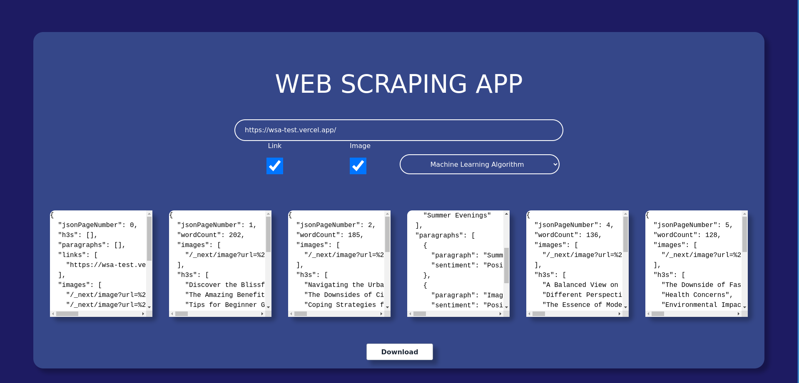

# Web Scraping App

Web Scraping app is a tool designed to web-scrape simple pages. It checks every page for paragraphs and H3 tags and then returns a JSON file containing them. The app analyses the paragraphs extracted from a page and using either a Simple NLP sentiment analysis or a Machine Learning based one marks the overlaying sentiment of the text.

# How to run

The app is dockerized. Just clone the repository build the docker images and run them :).
Also everything can be run locally by installing the required packages and then running the scritps.

## Tech Stack

The tool consists out of 3 services:
	- Frontend part: Built in [React]
	- Scraping Tool: Built in [NodeJs]
	- Sentiment Analisys Tool: Built in [Python] and [Flask] using [TensorFlow] (used for training the model)

## How it works
The app is running behind a [NodeJs] server which defines an endpoint at "/scrape" that awaits for GET requests. This endpoint needs several query parameters to work well e.g. 
    - url: Specifies the url for the page that is going to be scraped.
    - links: Specifies if links will be scraped from the pages (true/false).
    - img: Specifies if images will be scraped from the pages (true/false).
    - analysis: Specifies what algorithm for analysis should be used (none/simple/ml).
The Service is using [Puppeteer] in order to scrape the data. [Puppeteer] was chosen due to how pages are loaded, because sometimes JavaScript would load into a page after certain actions. So we need to also check for this cases. (That's also the reason I didn't choose a library like cheerios).
After the information is collected,it is sent to a [Flask] application which analyzes the paragraphs and computes the sentiments for each paragraph. There are two options :
    - Simple Algorithm: Basically a Simple NLP Analysis Algorithm that doesn't use any machine learning mechanism.
    - Machine Learning Algorithm: Was implemented using [TensorFlow].
Data is then sent back to the NodeJs app which then sends it back to the React app were is rendered as Slides.
Users can copy data by clicking the slides, or can download it by pressing the download button.
 

## License

MIT

**Free Software, Hell Yeah!**

[//]: # (These are reference links used in the body of this note and get stripped out when the markdown processor does its job. There is no need to format nicely because it shouldn't be seen. Thanks SO - http://stackoverflow.com/questions/4823468/store-comments-in-markdown-syntax)
   [Python]: <https://www.python.org/>
   [NodeJs]: <https://nodejs.org/en>
   [React]: <https://react.dev/>
   [TensorFlow]: <https://www.tensorflow.org/>
   [Puppeteer]: <https://pptr.dev/>
   [Flask]: <https://flask.palletsprojects.com/en/3.0.x/>
